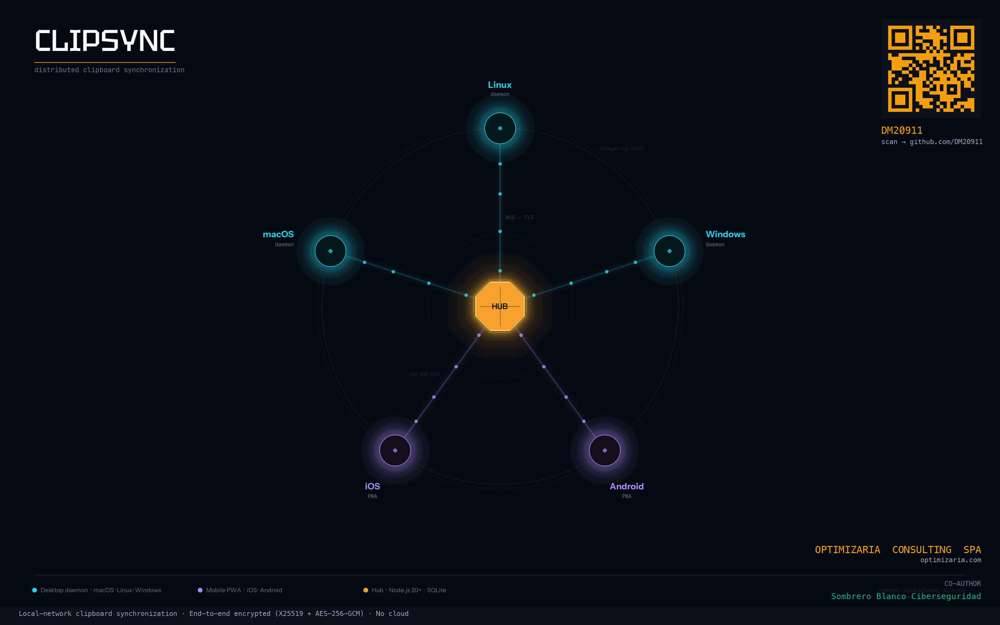
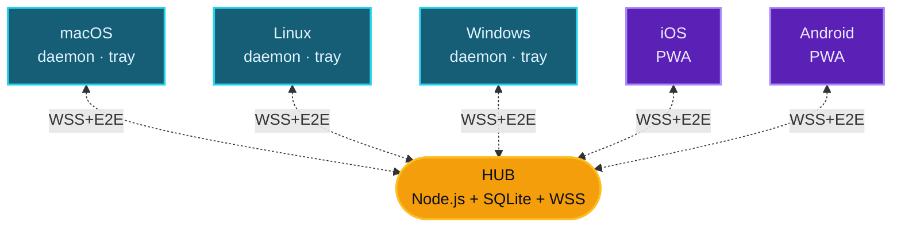

<div align="center">


# ClipSync

**Zwischenablage-Synchronisierung zwischen Geräten im lokalen Netzwerk**

<kbd>Cmd</kbd>+<kbd>C</kbd> auf einem Rechner · <kbd>Cmd</kbd>+<kbd>V</kbd> auf einem anderen · Ende-zu-Ende-verschlüsselt · ohne Cloud

<br />

[](LICENSE)
[](https://nodejs.org)
[](docs/architecture/security-model.md)
[](#)

<br />

[Español](README.md) · [English](README-EN.md) · [Français](README-FR.md) · [Português](README-PT.md) · [中文](README-ZH.md) · [Italiano](README-IT.md) · **Deutsch**

<br />



</div>

---

## Funktionsweise

Wenn du auf einem registrierten Gerät Text, ein Bild oder einen Link kopierst, erscheint der Inhalt automatisch in der Zwischenablage aller anderen Geräte.

```text
Mac:           Cmd+C  (du kopierst einen Link)
                  ↓ ~150 ms
PC Windows:    Ctrl+V → da ist er
iPhone:        ↑ tippe auf "Einfügen" → da ist er
```

Du musst keine Webseite öffnen und nichts manuell verschicken. Der Client auf jedem Gerät überwacht die Zwischenablage des Betriebssystems und propagiert Änderungen sofort über einen lokalen Hub.

> [!IMPORTANT]
> Das Web-Dashboard `https://hub:5679/admin` dient ausschließlich der Administration (Geräte registrieren, Zugriff widerrufen, Verlauf einsehen). Im Alltag **öffnest du es nie** — du kopierst und fügst einfach mit deiner Tastatur ein.

---

## Funktionsmerkmale

| | |
|---|---|
| **Plattformübergreifend** | macOS · Linux · Windows · iOS · Android (über PWA) |
| **Nur LAN** | Verlässt nie dein WLAN. Keine Konten, kein Tracking, keine Cloud |
| **E2E-Verschlüsselung** | AES-256-GCM mit über X25519 + HKDF abgeleiteten Schlüsseln. Der Hub sieht den Inhalt nie im Klartext |
| **Auto-Discovery** | mDNS findet den Hub ohne IP-Konfiguration |
| **TOFU pinning** | Der Client fixiert beim ersten Pairing den TLS-Fingerprint des Hubs und lehnt Änderungen ab |
| **Modi** | Tray-App (Icon in der Menüleiste) oder Daemon (Hintergrunddienst ohne UI) |
| **Unterstützt** | Text, URLs, Bilder und Dateien bis 50 MB |

---

## Architektur



| Komponente | Funktion |
|---|---|
| `hub/` | Zentraler Server. WSS broker · mDNS · Admin-Dashboard · liefert die PWA aus |
| `client-desktop/` | Kern des Clients: Sync-Engine, Clipboard-Monitor, Registrierung |
| `client-tray/` | Electron-App — Icon in Menu Bar / System Tray mit Menü |
| `client-pwa/` | PWA für Mobile/Tablet (Safari iOS 17.4+, Chrome 113+) |
| `shared/` | Protokollkonstanten + gemeinsam genutzte Crypto-Helpers |
| `bin/clipsync` | Vereinheitlichtes CLI (`status`, `switch tray\|daemon`, `register`, `logs`) |

---

## Quick start

Ein einzelner Rechner fungiert als **Hub** (auf dem der Server läuft). Alle anderen sind Clients, die sich verbinden.

### `1` &nbsp; Hub starten

```bash
git clone https://github.com/DM20911/clipsync.git
cd clipsync/hub
npm install
npm start
```

Beim ersten Start wird ein **Admin-Token** ausgegeben — kopiere ihn, er wird nur einmal angezeigt:

```text
[clipsync] Admin token (save — shown once):
[clipsync]   M24CYQAFDxJJD_GagzXtkXlY9Hnl4Zlq_Pt9gRgB-GA
```

> [!TIP]
> Notiere ebenfalls die lokale IP-Adresse des Hubs. Du erhältst sie mit `ifconfig` (macOS/Linux) oder `ipconfig` (Windows) — Format `192.168.x.x`.

### `2` &nbsp; Dashboard öffnen

Aus jedem Browser in deinem Netzwerk:

```text
https://<ip-hub>:5679/admin
```

Akzeptiere das selbstsignierte Zertifikat. Login mit dem Token. Klicke auf **`+ register new device`**, um einen PIN oder QR-Code zu erzeugen.

### `3` &nbsp; Client auf jedem Gerät installieren

| Gerät | Befehl | Tutorial |
|---|---|---|
| **macOS** | `bash scripts/install-mac.sh client` | [docs/tutorials/macos.md](docs/tutorials/macos.md) |
| **Linux** | `bash scripts/install-linux.sh client` | [docs/tutorials/linux.md](docs/tutorials/linux.md) |
| **Windows** | `.\scripts\install-win.ps1 -Role client` &nbsp;(PowerShell admin) | [docs/tutorials/windows.md](docs/tutorials/windows.md) |
| **Mobil / Browser** | öffne &nbsp;`https://<ip-hub>:5679/`&nbsp; auf deinem Mobilgerät | [docs/tutorials/pwa.md](docs/tutorials/pwa.md) |

### `4` &nbsp; Verwendung

<kbd>Cmd</kbd>+<kbd>C</kbd> auf Mac/Linux oder <kbd>Ctrl</kbd>+<kbd>C</kbd> auf Windows → erscheint auf den anderen Geräten in ~150 ms.

> [!NOTE]
> **[Vollständige Schritt-für-Schritt-Anleitung](docs/tutorials/README.md)** — was es ist, wie es funktioniert, Konzepte, FAQ, Troubleshooting.

---

## Modi des Desktop-Clients

<table>
<tr><th width="200">Modus</th><th>Wann</th></tr>
<tr><td><strong>Tray</strong> &nbsp;<sub>empfohlen</sub></td>
<td>Persönlicher Rechner. Icon in der Menu Bar — Klick → Status, Peers, Recent Clips, Pause</td></tr>
<tr><td><strong>Daemon</strong></td>
<td>Headless-Server (NAS, Raspberry Pi). Systemdienst ohne UI</td></tr>
</table>

Du kannst jederzeit ohne Neuregistrierung wechseln:

```bash
node bin/clipsync switch tray
node bin/clipsync switch daemon
node bin/clipsync status
```

---

## Sicherheitsmodell

> [!IMPORTANT]
> Alle Inhalte sind Ende-zu-Ende-verschlüsselt. Der Hub speichert verschlüsselte Bundles, **besitzt aber kein Material zur Entschlüsselung**.

- **Per-Device-Verschlüsselung**: Jedes Gerät erzeugt bei der Registrierung ein X25519-Keypair. Zum Versand eines Clips erzeugt der Sender einen zufälligen Content-Key, verschlüsselt das Payload mit AES-256-GCM und wrappt diesen Schlüssel pro Empfänger über ECDH(X25519) → HKDF-SHA256 → AES-GCM-wrap.
- **Echte Revocation**: Beim Widerruf eines Geräts wird dessen Public Key aus der Empfängerliste entfernt. Künftige Clips werden nie mehr für dieses Gerät verschlüsselt.
- **Admin-Auth**: zufällig auf der Konsole ausgegebenes Token (Standard), `CLIPSYNC_ADMIN_PASSWORD` mit scrypt oder „erstes registriertes Gerät = Admin".
- **Rate Limiting**: Token-Bucket auf `PUSH` und `HISTORY_REQ`, Attempt-Counter pro IP bei Login und Registrierung.
- **TOFU pinning** des TLS-Zertifikats des Hubs in den Desktop-Clients.
- **Strikte CSP** im vom Hub ausgelieferten HTML.
- **JTI revocation cascade** beim Widerruf eines Geräts.

Siehe [docs/architecture/security-model.md](docs/architecture/security-model.md) für das vollständige kryptografische Modell.

---

## Voraussetzungen

| | |
|---|---|
| **Node.js** | ≥ 18 (empfohlen 20 LTS) auf Hub und Desktop-Clients |
| **macOS** | 12 Monterey oder höher |
| **Linux** | mit systemd (Ubuntu, Fedora, Arch, Debian, etc.) |
| **Windows** | 10 Build 1903+ oder Windows 11 |
| **Browser PWA** | Chrome 113+, Firefox 119+, Safari 17.4+ |
| **Netzwerk** | Gleiches privates Netzwerk (RFC1918 — `192.168/16`, `10/8`, `172.16/12`) |

---

## Tech-Stack

<table>
<tr><th>Hub</th><td>Node.js · <code>ws</code> · <code>better-sqlite3</code> · <code>node-forge</code> (TLS) · <code>qrcode</code> · mDNS via <code>multicast-dns</code></td></tr>
<tr><th>Desktop-Client</th><td>Node.js · <code>clipboardy</code> · <code>ws</code> · OS-Helpers für Bilder (osascript / wl-clipboard / xclip / PowerShell)</td></tr>
<tr><th>Tray</th><td>Electron · <code>auto-launch</code></td></tr>
<tr><th>PWA</th><td>HTML/JS vanilla · Web Crypto API · IndexedDB · Tailwind CDN</td></tr>
<tr><th>Crypto</th><td><code>node:crypto</code> (natives X25519) · HKDF-SHA256 · AES-256-GCM</td></tr>
</table>

---

## Lizenz

[MIT](LICENSE)

---

<div align="center">

Tool entwickelt von [**DM20911**](https://github.com/DM20911) — [**OptimizarIA Consulting SPA**](https://optimizaria.com)

<sub>Co-Autor: Sombrero Blanco Ciberseguridad</sub>

</div>
