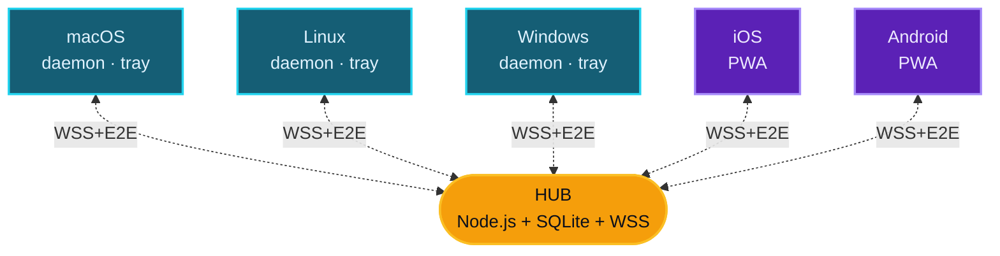

<div align="center">


# ClipSync

**Clipboard sync across devices on your local network**

<kbd>Cmd</kbd>+<kbd>C</kbd> on one machine · <kbd>Cmd</kbd>+<kbd>V</kbd> on another · end-to-end encrypted · no cloud

<br />

[](LICENSE)
[](https://nodejs.org)
[](docs/architecture/security-model.md)
[](#)

<br />

[Español](README.md) · **English** · [Français](README-FR.md) · [Português](README-PT.md) · [中文](README-ZH.md) · [Italiano](README-IT.md) · [Deutsch](README-DE.md)

<br />


</div>

---

## What it does

When you copy text, an image, or a link on any registered device, it automatically appears on the clipboard of all the others.

```text
Mac:           Cmd+C  (copy a link)
                  ↓ ~150 ms
PC Windows:    Ctrl+V → there it is
iPhone:        ↑ tap "Paste" → there it is
```

You don't open any page, you don't send anything manually. Each device's client watches the OS clipboard and propagates changes instantly through a local hub.

> [!IMPORTANT]
> The web dashboard `https://hub:5679/admin` is only for administration (registering devices, revoking access, viewing history). In day-to-day use you **never open it** — you just copy and paste with your keyboard.

---

## Features

| | |
|---|---|
| **Cross-platform** | macOS · Linux · Windows · iOS · Android (via PWA) |
| **LAN-only** | Never leaves your Wi-Fi network. No accounts, no tracking, no cloud |
| **E2E encryption** | AES-256-GCM with keys derived via X25519 + HKDF. The hub never sees plaintext content |
| **Auto-discovery** | mDNS to find the hub without configuring IPs |
| **TOFU pinning** | The client pins the hub's TLS fingerprint at first pairing and rejects changes |
| **Modes** | Tray app (menu bar icon) or daemon (headless service) |
| **Supports** | Text, URLs, images, and files up to 50 MB |

---

## Architecture



| Component | What it does |
|---|---|
| `hub/` | Central server. WSS broker · mDNS · admin dashboard · serves the PWA |
| `client-desktop/` | Client core: sync engine, clipboard monitor, registration |
| `client-tray/` | Electron app — menu bar / system tray icon with menu |
| `client-pwa/` | PWA for mobile/tablet (Safari iOS 17.4+, Chrome 113+) |
| `shared/` | Protocol constants + shared crypto helpers |
| `bin/clipsync` | Unified CLI (`status`, `switch tray\|daemon`, `register`, `logs`) |

---

## Quick start

One machine acts as the **hub** (where the server runs). The rest are clients that connect to it.

### `1` &nbsp; Start the hub

```bash
git clone https://github.com/DM20911/clipsync.git
cd clipsync/hub
npm install
npm start
```

On first run it prints an **admin token** — copy it, it's shown only once:

```text
[clipsync] Admin token (save — shown once):
[clipsync]   M24CYQAFDxJJD_GagzXtkXlY9Hnl4Zlq_Pt9gRgB-GA
```

> [!TIP]
> Note the hub's local IP as well. Get it with `ifconfig` (macOS/Linux) or `ipconfig` (Windows) — format `192.168.x.x`.

### `2` &nbsp; Open the dashboard

From any browser on your network:

```text
https://<ip-hub>:5679/admin
```

Accept the self-signed certificate. Log in with the token. Click **`+ register new device`** to generate a PIN or QR code.

### `3` &nbsp; Install the client on each device

| Device | Command | Tutorial |
|---|---|---|
| **macOS** | `bash scripts/install-mac.sh client` | [docs/tutorials/macos.md](docs/tutorials/macos.md) |
| **Linux** | `bash scripts/install-linux.sh client` | [docs/tutorials/linux.md](docs/tutorials/linux.md) |
| **Windows** | `.\scripts\install-win.ps1 -Role client` &nbsp;(PowerShell admin) | [docs/tutorials/windows.md](docs/tutorials/windows.md) |
| **Mobile / Browser** | open &nbsp;`https://<ip-hub>:5679/`&nbsp; on your phone | [docs/tutorials/pwa.md](docs/tutorials/pwa.md) |

### `4` &nbsp; Use it

<kbd>Cmd</kbd>+<kbd>C</kbd> on Mac/Linux or <kbd>Ctrl</kbd>+<kbd>C</kbd> on Windows → it shows up on the others in ~150 ms.

> [!NOTE]
> **[Full step-by-step manual](docs/tutorials/README.md)** — what it is, how it works, concepts, FAQ, troubleshooting.

---

## Desktop client modes

<table>
<tr><th width="200">Mode</th><th>When to use</th></tr>
<tr><td><strong>Tray</strong> &nbsp;<sub>recommended</sub></td>
<td>Personal machine. Menu bar icon — click → status, peers, recent clips, pause</td></tr>
<tr><td><strong>Daemon</strong></td>
<td>Headless server (NAS, Raspberry Pi). System service with no UI</td></tr>
</table>

Switch any time without re-registering:

```bash
node bin/clipsync switch tray
node bin/clipsync switch daemon
node bin/clipsync status
```

---

## Security model

> [!IMPORTANT]
> All content is end-to-end encrypted. The hub stores encrypted bundles but **holds no material to decrypt anything**.

- **Per-device encryption**: each device generates an X25519 keypair on registration. To send a clip, the sender generates a random content key, encrypts the payload with AES-256-GCM, and wraps that key per recipient using ECDH(X25519) → HKDF-SHA256 → AES-GCM-wrap.
- **Real revocation**: revoking a device removes its pubkey from the recipient list. Future clips are never encrypted for it.
- **Admin auth**: random token printed to console (default), `CLIPSYNC_ADMIN_PASSWORD` with scrypt, or "first registered device = admin".
- **Rate limiting**: token-bucket on `PUSH` and `HISTORY_REQ`, attempt counter per IP on login and registration.
- **TOFU pinning** of the hub's TLS cert on desktop clients.
- **Strict CSP** on HTML served by the hub.
- **JTI revocation cascade** when a device is revoked.

See [docs/architecture/security-model.md](docs/architecture/security-model.md) for the full cryptographic model.

---

## Requirements

| | |
|---|---|
| **Node.js** | ≥ 18 (20 LTS recommended) on hub and desktop clients |
| **macOS** | 12 Monterey or later |
| **Linux** | with systemd (Ubuntu, Fedora, Arch, Debian, etc.) |
| **Windows** | 10 build 1903+ or Windows 11 |
| **PWA browser** | Chrome 113+, Firefox 119+, Safari 17.4+ |
| **Network** | Same private network (RFC1918 — `192.168/16`, `10/8`, `172.16/12`) |

---

## Tech stack

<table>
<tr><th>Hub</th><td>Node.js · <code>ws</code> · <code>better-sqlite3</code> · <code>node-forge</code> (TLS) · <code>qrcode</code> · mDNS via <code>multicast-dns</code></td></tr>
<tr><th>Desktop client</th><td>Node.js · <code>clipboardy</code> · <code>ws</code> · OS helpers for images (osascript / wl-clipboard / xclip / PowerShell)</td></tr>
<tr><th>Tray</th><td>Electron · <code>auto-launch</code></td></tr>
<tr><th>PWA</th><td>vanilla HTML/JS · Web Crypto API · IndexedDB · Tailwind CDN</td></tr>
<tr><th>Crypto</th><td><code>node:crypto</code> (native X25519) · HKDF-SHA256 · AES-256-GCM</td></tr>
</table>

---

## License

[MIT](LICENSE)

---

<div align="center">

Tool developed by [**DM20911**](https://github.com/DM20911) — [**OptimizarIA Consulting SPA**](https://optimizaria.com)

<sub>Co-author: Sombrero Blanco Ciberseguridad</sub>

</div>
