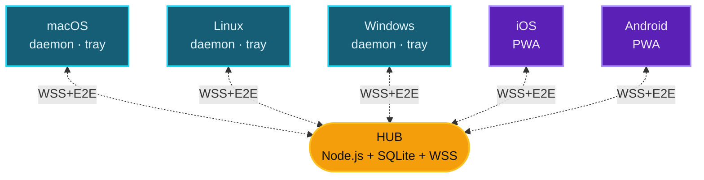

<div align="center">


# ClipSync

**Synchronisation du presse-papiers entre appareils sur réseau local**

<kbd>Cmd</kbd>+<kbd>C</kbd> sur une machine · <kbd>Cmd</kbd>+<kbd>V</kbd> sur une autre · chiffrement de bout en bout · sans cloud

<br />

[](LICENSE)
[](https://nodejs.org)
[](docs/architecture/security-model.md)
[](#)

<br />

[Español](README.md) · [English](README-EN.md) · **Français** · [Português](README-PT.md) · [中文](README-ZH.md) · [Italiano](README-IT.md) · [Deutsch](README-DE.md)

<br />


</div>

---

## Ce que fait l'outil

Lorsque vous copiez du texte, une image ou un lien sur n'importe quel appareil enregistré, le contenu apparaît automatiquement dans le presse-papiers des autres.

```text
Mac:           Cmd+C  (vous copiez un lien)
                  ↓ ~150 ms
PC Windows:    Ctrl+V → il est là
iPhone:        ↑ tap « Coller » → il est là
```

Vous n'ouvrez aucune page, vous n'envoyez rien manuellement. Le client de chaque appareil surveille le presse-papiers du système d'exploitation et propage les changements instantanément via un hub local.

> [!IMPORTANT]
> Le dashboard web `https://hub:5679/admin` sert uniquement à l'administration (enregistrer des appareils, révoquer des accès, consulter l'historique). Au quotidien, **vous ne l'ouvrez jamais** — vous ne faites que copier-coller au clavier.

---

## Fonctionnalités

| | |
|---|---|
| **Multi-plateforme** | macOS · Linux · Windows · iOS · Android (via PWA) |
| **LAN uniquement** | Ne quitte jamais votre réseau Wi-Fi. Pas de comptes, pas de tracking, pas de cloud |
| **Chiffrement E2E** | AES-256-GCM avec clés dérivées via X25519 + HKDF. Le hub ne voit jamais le contenu en clair |
| **Auto-discovery** | mDNS pour trouver le hub sans configurer d'IP |
| **TOFU pinning** | Le client épingle l'empreinte TLS du hub lors du premier pairing et rejette tout changement |
| **Modes** | Tray app (icône dans la menu bar) ou daemon (service sans UI) |
| **Prend en charge** | Texte, URL, images et fichiers jusqu'à 50 Mo |

---

## Architecture



| Composant | Rôle |
|---|---|
| `hub/` | Serveur central. WSS broker · mDNS · dashboard admin · sert la PWA |
| `client-desktop/` | Cœur du client : moteur de sync, monitor de presse-papiers, enregistrement |
| `client-tray/` | App Electron — icône dans la menu bar / system tray avec menu |
| `client-pwa/` | PWA pour mobile/tablette (Safari iOS 17.4+, Chrome 113+) |
| `shared/` | Constantes de protocole + helpers crypto partagés |
| `bin/clipsync` | CLI unifiée (`status`, `switch tray\|daemon`, `register`, `logs`) |

---

## Quick start

Une seule machine fait office de **hub** (où tourne le serveur). Les autres sont des clients qui s'y connectent.

### `1` &nbsp; Lancer le hub

```bash
git clone https://github.com/DM20911/clipsync.git
cd clipsync/hub
npm install
npm start
```

À la première exécution, un **token admin** est affiché — copiez-le, il n'est montré qu'une seule fois :

```text
[clipsync] Admin token (save — shown once):
[clipsync]   M24CYQAFDxJJD_GagzXtkXlY9Hnl4Zlq_Pt9gRgB-GA
```

> [!TIP]
> Notez aussi l'IP locale du hub. Vous l'obtenez avec `ifconfig` (macOS/Linux) ou `ipconfig` (Windows) — format `192.168.x.x`.

### `2` &nbsp; Ouvrir le dashboard

Depuis n'importe quel navigateur de votre réseau :

```text
https://<ip-hub>:5679/admin
```

Acceptez le certificat self-signed. Connectez-vous avec le token. Cliquez sur **`+ register new device`** pour générer un PIN ou un QR.

### `3` &nbsp; Installer le client sur chaque appareil

| Appareil | Commande | Tutoriel |
|---|---|---|
| **macOS** | `bash scripts/install-mac.sh client` | [docs/tutorials/macos.md](docs/tutorials/macos.md) |
| **Linux** | `bash scripts/install-linux.sh client` | [docs/tutorials/linux.md](docs/tutorials/linux.md) |
| **Windows** | `.\scripts\install-win.ps1 -Role client` &nbsp;(PowerShell admin) | [docs/tutorials/windows.md](docs/tutorials/windows.md) |
| **Mobile / Browser** | ouvrez &nbsp;`https://<ip-hub>:5679/`&nbsp; sur votre mobile | [docs/tutorials/pwa.md](docs/tutorials/pwa.md) |

### `4` &nbsp; Utilisation

<kbd>Cmd</kbd>+<kbd>C</kbd> sur Mac/Linux ou <kbd>Ctrl</kbd>+<kbd>C</kbd> sur Windows → le contenu apparaît sur les autres appareils en ~150 ms.

> [!NOTE]
> **[Manuel complet pas à pas](docs/tutorials/README.md)** — qu'est-ce que c'est, comment ça fonctionne, concepts, FAQ, troubleshooting.

---

## Modes du client desktop

<table>
<tr><th width="200">Mode</th><th>Quand l'utiliser</th></tr>
<tr><td><strong>Tray</strong> &nbsp;<sub>recommandé</sub></td>
<td>Poste personnel. Icône dans la menu bar — clic → état, peers, recent clips, pause</td></tr>
<tr><td><strong>Daemon</strong></td>
<td>Serveur headless (NAS, Raspberry Pi). Service système sans UI</td></tr>
</table>

Vous pouvez basculer à tout moment sans réenregistrer l'appareil :

```bash
node bin/clipsync switch tray
node bin/clipsync switch daemon
node bin/clipsync status
```

---

## Modèle de sécurité

> [!IMPORTANT]
> L'ensemble du contenu est chiffré de bout en bout. Le hub stocke des bundles chiffrés mais **ne possède aucun matériel pour déchiffrer quoi que ce soit**.

- **Chiffrement per-device** : chaque appareil génère une keypair X25519 lors de l'enregistrement. Pour envoyer un clip, l'émetteur génère une clé de contenu aléatoire, chiffre le payload en AES-256-GCM, puis encapsule cette clé pour chaque destinataire via ECDH(X25519) → HKDF-SHA256 → AES-GCM-wrap (envelope encryption).
- **Révocation effective** : révoquer un appareil supprime sa pubkey de la liste des destinataires. Les clips futurs ne sont jamais chiffrés à son intention.
- **Admin auth** : token aléatoire imprimé en console (par défaut), `CLIPSYNC_ADMIN_PASSWORD` avec scrypt, ou « premier appareil enregistré = admin ».
- **Rate limiting** : token-bucket sur `PUSH` et `HISTORY_REQ`, attempt counter par IP au login et à l'enregistrement.
- **TOFU pinning** du certificat TLS du hub côté clients desktop.
- **CSP stricte** sur le HTML servi par le hub.
- **JTI revocation cascade** lors de la révocation d'un appareil.

Voir [docs/architecture/security-model.md](docs/architecture/security-model.md) pour le modèle cryptographique complet.

---

## Prérequis

| | |
|---|---|
| **Node.js** | ≥ 18 (recommandé : 20 LTS) sur le hub et les clients desktop |
| **macOS** | 12 Monterey ou supérieur |
| **Linux** | avec systemd (Ubuntu, Fedora, Arch, Debian, etc.) |
| **Windows** | 10 build 1903+ ou Windows 11 |
| **Browser PWA** | Chrome 113+, Firefox 119+, Safari 17.4+ |
| **Réseau** | Même réseau privé (RFC1918 — `192.168/16`, `10/8`, `172.16/12`) |

---

## Stack technique

<table>
<tr><th>Hub</th><td>Node.js · <code>ws</code> · <code>better-sqlite3</code> · <code>node-forge</code> (TLS) · <code>qrcode</code> · mDNS via <code>multicast-dns</code></td></tr>
<tr><th>Client desktop</th><td>Node.js · <code>clipboardy</code> · <code>ws</code> · helpers OS pour les images (osascript / wl-clipboard / xclip / PowerShell)</td></tr>
<tr><th>Tray</th><td>Electron · <code>auto-launch</code></td></tr>
<tr><th>PWA</th><td>HTML/JS vanilla · Web Crypto API · IndexedDB · Tailwind CDN</td></tr>
<tr><th>Crypto</th><td><code>node:crypto</code> (X25519 natif) · HKDF-SHA256 · AES-256-GCM</td></tr>
</table>

---

## Licence

[MIT](LICENSE)

---

<div align="center">

Outil développé par [**DM20911**](https://github.com/DM20911) — [**OptimizarIA Consulting SPA**](https://optimizaria.com)

<sub>Co-auteur : Sombrero Blanco Ciberseguridad</sub>

</div>
