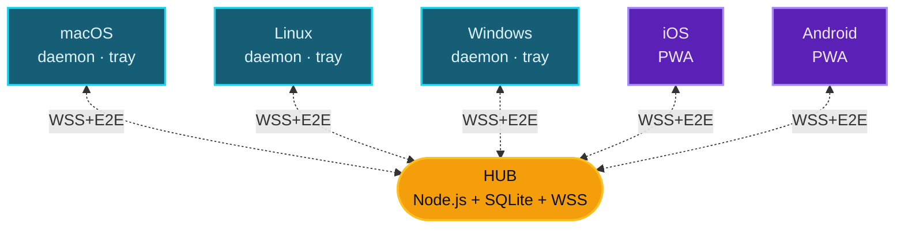

<div align="center">


# ClipSync

**Sincronizzazione degli appunti tra dispositivi sulla rete locale**

<kbd>Cmd</kbd>+<kbd>C</kbd> su una macchina · <kbd>Cmd</kbd>+<kbd>V</kbd> su un'altra · cifratura end-to-end · senza cloud

<br />

[](LICENSE)
[](https://nodejs.org)
[](docs/architecture/security-model.md)
[](#)

<br />

[Español](README.md) · [English](README-EN.md) · [Français](README-FR.md) · [Português](README-PT.md) · [中文](README-ZH.md) · **Italiano** · [Deutsch](README-DE.md)

<br />


</div>

---

## Cosa fa

Quando copi un testo, un'immagine o un link su qualsiasi dispositivo registrato, questo compare automaticamente negli appunti degli altri.

```text
Mac:           Cmd+C  (copi un link)
                  ↓ ~150 ms
PC Windows:    Ctrl+V → eccolo
iPhone:        ↑ tap "Incolla" → eccolo
```

Non apri nessuna pagina, non invii nulla manualmente. Il client di ogni dispositivo monitora gli appunti del sistema operativo e propaga le modifiche all'istante attraverso un hub locale.

> [!IMPORTANT]
> La dashboard web `https://hub:5679/admin` serve solo per l'amministrazione (registrare dispositivi, revocare accessi, vedere lo storico). Nell'uso quotidiano **non la apri mai** — copi e incolli con la tastiera e basta.

---

## Caratteristiche

| | |
|---|---|
| **Multi-piattaforma** | macOS · Linux · Windows · iOS · Android (tramite PWA) |
| **Solo LAN** | Non esce mai dalla tua rete Wi-Fi. Senza account, senza tracking, senza cloud |
| **Cifratura E2E** | AES-256-GCM con chiavi derivate tramite X25519 + HKDF. L'hub non vede mai il contenuto in chiaro |
| **Auto-discovery** | mDNS per individuare l'hub senza configurare IP |
| **TOFU pinning** | Il client fissa l'impronta TLS dell'hub al primo pairing e rifiuta modifiche |
| **Modalità** | Tray app (icona nella menu bar) oppure daemon (servizio senza UI) |
| **Supporta** | Testo, URL, immagini e file fino a 50 MB |

---

## Architettura



| Componente | Cosa fa |
|---|---|
| `hub/` | Server centrale. WSS broker · mDNS · dashboard admin · serve la PWA |
| `client-desktop/` | Nucleo del client: motore di sync, monitor degli appunti, registrazione |
| `client-tray/` | App Electron — icona nella menu bar / system tray con menu |
| `client-pwa/` | PWA per mobile/tablet (Safari iOS 17.4+, Chrome 113+) |
| `shared/` | Costanti di protocollo + helper di crypto condivisi |
| `bin/clipsync` | CLI unificato (`status`, `switch tray\|daemon`, `register`, `logs`) |

---

## Quick start

Una sola macchina funge da **hub** (dove gira il server). Le altre sono client che si connettono.

### `1` &nbsp; Avviare l'hub

```bash
git clone https://github.com/DM20911/clipsync.git
cd clipsync/hub
npm install
npm start
```

Alla prima esecuzione viene stampato un **token di admin** — copialo, viene mostrato una sola volta:

```text
[clipsync] Admin token (save — shown once):
[clipsync]   M24CYQAFDxJJD_GagzXtkXlY9Hnl4Zlq_Pt9gRgB-GA
```

> [!TIP]
> Annota anche l'IP locale dell'hub. Lo ottieni con `ifconfig` (macOS/Linux) o `ipconfig` (Windows) — formato `192.168.x.x`.

### `2` &nbsp; Aprire la dashboard

Da qualsiasi browser della tua rete:

```text
https://<ip-hub>:5679/admin
```

Accetta il certificato self-signed. Login con il token. Click su **`+ register new device`** per generare un PIN o QR.

### `3` &nbsp; Installare il client su ogni dispositivo

| Dispositivo | Comando | Tutorial |
|---|---|---|
| **macOS** | `bash scripts/install-mac.sh client` | [docs/tutorials/macos.md](docs/tutorials/macos.md) |
| **Linux** | `bash scripts/install-linux.sh client` | [docs/tutorials/linux.md](docs/tutorials/linux.md) |
| **Windows** | `.\scripts\install-win.ps1 -Role client` &nbsp;(PowerShell admin) | [docs/tutorials/windows.md](docs/tutorials/windows.md) |
| **Mobile / Browser** | apri &nbsp;`https://<ip-hub>:5679/`&nbsp; sul cellulare | [docs/tutorials/pwa.md](docs/tutorials/pwa.md) |

### `4` &nbsp; Utilizzo

<kbd>Cmd</kbd>+<kbd>C</kbd> su Mac/Linux o <kbd>Ctrl</kbd>+<kbd>C</kbd> su Windows → compare sugli altri in ~150 ms.

> [!NOTE]
> **[Manuale completo passo passo](docs/tutorials/README.md)** — cos'è, come funziona, concetti, FAQ, troubleshooting.

---

## Modalità del client desktop

<table>
<tr><th width="200">Modalità</th><th>Quando</th></tr>
<tr><td><strong>Tray</strong> &nbsp;<sub>consigliata</sub></td>
<td>Computer personale. Icona nella menu bar — click → stato, peers, recent clips, pause</td></tr>
<tr><td><strong>Daemon</strong></td>
<td>Server headless (NAS, Raspberry Pi). Servizio di sistema senza UI</td></tr>
</table>

Cambi modalità in qualsiasi momento senza ri-registrarti:

```bash
node bin/clipsync switch tray
node bin/clipsync switch daemon
node bin/clipsync status
```

---

## Modello di sicurezza

> [!IMPORTANT]
> Tutto il contenuto è cifrato end-to-end. L'hub memorizza bundle cifrati ma **non possiede materiale per decifrare nulla**.

- **Cifratura per dispositivo**: ogni dispositivo genera una keypair X25519 al momento della registrazione. Per inviare un clip, il mittente genera una chiave di contenuto casuale, cifra il payload con AES-256-GCM e incapsula tale chiave per ciascun destinatario tramite ECDH(X25519) → HKDF-SHA256 → AES-GCM-wrap.
- **Revoca effettiva**: la revoca di un dispositivo rimuove la sua pubkey dalla lista dei destinatari. I clip futuri non verranno mai cifrati per esso.
- **Admin auth**: token casuale stampato in console (default), `CLIPSYNC_ADMIN_PASSWORD` con scrypt, oppure "primo dispositivo registrato = admin".
- **Rate limiting**: token-bucket su `PUSH` e `HISTORY_REQ`, attempt counter per IP su login e registrazione.
- **TOFU pinning** del certificato TLS dell'hub sui client desktop.
- **CSP rigorosa** sull'HTML servito dall'hub.
- **JTI revocation cascade** alla revoca di un dispositivo.

Vedi [docs/architecture/security-model.md](docs/architecture/security-model.md) per il modello crittografico completo.

---

## Requisiti

| | |
|---|---|
| **Node.js** | ≥ 18 (consigliato 20 LTS) sull'hub e sui client desktop |
| **macOS** | 12 Monterey o superiore |
| **Linux** | con systemd (Ubuntu, Fedora, Arch, Debian, ecc.) |
| **Windows** | 10 build 1903+ o Windows 11 |
| **Browser PWA** | Chrome 113+, Firefox 119+, Safari 17.4+ |
| **Rete** | Stessa rete privata (RFC1918 — `192.168/16`, `10/8`, `172.16/12`) |

---

## Stack tecnico

<table>
<tr><th>Hub</th><td>Node.js · <code>ws</code> · <code>better-sqlite3</code> · <code>node-forge</code> (TLS) · <code>qrcode</code> · mDNS tramite <code>multicast-dns</code></td></tr>
<tr><th>Client desktop</th><td>Node.js · <code>clipboardy</code> · <code>ws</code> · helper di OS per le immagini (osascript / wl-clipboard / xclip / PowerShell)</td></tr>
<tr><th>Tray</th><td>Electron · <code>auto-launch</code></td></tr>
<tr><th>PWA</th><td>HTML/JS vanilla · Web Crypto API · IndexedDB · Tailwind CDN</td></tr>
<tr><th>Crypto</th><td><code>node:crypto</code> (X25519 nativo) · HKDF-SHA256 · AES-256-GCM</td></tr>
</table>

---

## Licenza

[MIT](LICENSE)

---

<div align="center">

Strumento sviluppato da [**DM20911**](https://github.com/DM20911) — [**OptimizarIA Consulting SPA**](https://optimizaria.com)

<sub>Coautore: Sombrero Blanco Ciberseguridad</sub>

</div>
