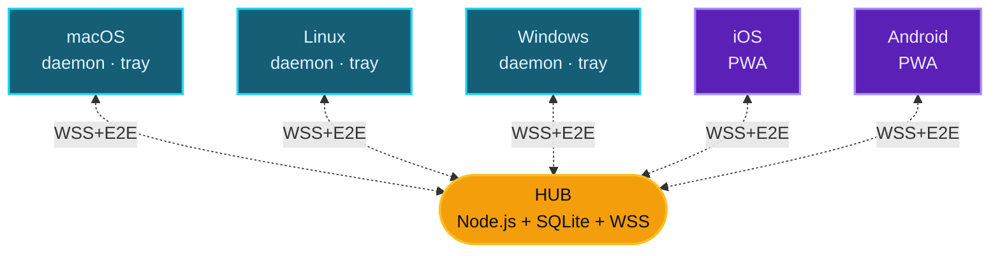

<div align="center">


# ClipSync

**Sincronização de área de transferência entre dispositivos na rede local**

<kbd>Cmd</kbd>+<kbd>C</kbd> em uma máquina · <kbd>Cmd</kbd>+<kbd>V</kbd> em outra · criptografia ponta a ponta · sem nuvem

<br />

[](LICENSE)
[](https://nodejs.org)
[](docs/architecture/security-model.md)
[](#)

<br />

[Español](README.md) · [English](README-EN.md) · [Français](README-FR.md) · **Português** · [中文](README-ZH.md) · [Italiano](README-IT.md) · [Deutsch](README-DE.md)

<br />


</div>

---

## O que faz

Quando você copia um texto, uma imagem ou um link em qualquer dispositivo registrado, ele aparece automaticamente na área de transferência dos demais.

```text
Mac:           Cmd+C  (você copia um link)
                  ↓ ~150 ms
PC Windows:    Ctrl+V → está lá
iPhone:        ↑ toque em "Colar" → está lá
```

Você não abre nenhuma página, nem envia nada manualmente. O cliente de cada dispositivo monitora a área de transferência do sistema operacional e propaga as alterações instantaneamente através de um hub local.

> [!IMPORTANT]
> O dashboard web `https://hub:5679/admin` serve apenas para administração (registrar dispositivos, revogar acesso, ver histórico). No dia a dia **você nunca o abre** — apenas copia e cola com o teclado.

---

## Características

| | |
|---|---|
| **Multiplataforma** | macOS · Linux · Windows · iOS · Android (via PWA) |
| **Apenas LAN** | Nunca sai da sua rede Wi-Fi. Sem contas, sem tracking, sem nuvem |
| **Criptografia E2E** | AES-256-GCM com chaves derivadas via X25519 + HKDF. O hub nunca enxerga o conteúdo em claro |
| **Auto-discovery** | mDNS para encontrar o hub sem configurar IPs |
| **TOFU pinning** | O cliente fixa a fingerprint TLS do hub no primeiro pairing e rejeita alterações |
| **Modos** | Tray app (ícone na menu bar) ou daemon (serviço sem UI) |
| **Suporta** | Texto, URLs, imagens e arquivos de até 50 MB |

---

## Arquitetura



| Componente | O que faz |
|---|---|
| `hub/` | Servidor central. WSS broker · mDNS · dashboard admin · serve a PWA |
| `client-desktop/` | Núcleo do cliente: motor de sync, monitor da área de transferência, registro |
| `client-tray/` | App Electron — ícone na menu bar / system tray com menu |
| `client-pwa/` | PWA para mobile/tablet (Safari iOS 17.4+, Chrome 113+) |
| `shared/` | Constantes de protocolo + helpers de crypto compartilhados |
| `bin/clipsync` | CLI unificado (`status`, `switch tray\|daemon`, `register`, `logs`) |

---

## Quick start

Uma única máquina atua como **hub** (onde roda o servidor). As demais são clientes que se conectam.

### `1` &nbsp; Subir o hub

```bash
git clone https://github.com/DM20911/clipsync.git
cd clipsync/hub
npm install
npm start
```

Na primeira execução é impresso um **token de admin** — copie-o, ele é exibido apenas uma vez:

```text
[clipsync] Admin token (save — shown once):
[clipsync]   M24CYQAFDxJJD_GagzXtkXlY9Hnl4Zlq_Pt9gRgB-GA
```

> [!TIP]
> Anote também o IP local do hub. Você o obtém com `ifconfig` (macOS/Linux) ou `ipconfig` (Windows) — formato `192.168.x.x`.

### `2` &nbsp; Abrir o dashboard

Em qualquer browser da sua rede:

```text
https://<ip-hub>:5679/admin
```

Aceite o certificado self-signed. Faça login com o token. Clique em **`+ register new device`** para gerar um PIN ou QR.

### `3` &nbsp; Instalar o cliente em cada dispositivo

| Dispositivo | Comando | Tutorial |
|---|---|---|
| **macOS** | `bash scripts/install-mac.sh client` | [docs/tutorials/macos.md](docs/tutorials/macos.md) |
| **Linux** | `bash scripts/install-linux.sh client` | [docs/tutorials/linux.md](docs/tutorials/linux.md) |
| **Windows** | `.\scripts\install-win.ps1 -Role client` &nbsp;(PowerShell admin) | [docs/tutorials/windows.md](docs/tutorials/windows.md) |
| **Mobile / Browser** | abra &nbsp;`https://<ip-hub>:5679/`&nbsp; no celular | [docs/tutorials/pwa.md](docs/tutorials/pwa.md) |

### `4` &nbsp; Como usar

<kbd>Cmd</kbd>+<kbd>C</kbd> no Mac/Linux ou <kbd>Ctrl</kbd>+<kbd>C</kbd> no Windows → aparece nos demais em ~150 ms.

> [!NOTE]
> **[Manual completo passo a passo](docs/tutorials/README.md)** — o que é, como funciona, conceitos, FAQ, troubleshooting.

---

## Modos do cliente desktop

<table>
<tr><th width="200">Modo</th><th>Quando usar</th></tr>
<tr><td><strong>Tray</strong> &nbsp;<sub>recomendado</sub></td>
<td>Equipamento pessoal. Ícone na menu bar — clique → status, peers, recent clips, pause</td></tr>
<tr><td><strong>Daemon</strong></td>
<td>Servidor headless (NAS, Raspberry Pi). Serviço do sistema sem UI</td></tr>
</table>

Você alterna quando quiser, sem precisar registrar novamente:

```bash
node bin/clipsync switch tray
node bin/clipsync switch daemon
node bin/clipsync status
```

---

## Modelo de segurança

> [!IMPORTANT]
> Todo o conteúdo é criptografado de ponta a ponta. O hub armazena bundles criptografados, mas **não possui material para descriptografar nada**.

- **Criptografia per-device**: cada dispositivo gera um keypair X25519 ao se registrar. Para enviar um clip, o emissor gera uma chave de conteúdo aleatória, criptografa o payload com AES-256-GCM e faz o envelope dessa chave por destinatário usando ECDH(X25519) → HKDF-SHA256 → AES-GCM-wrap.
- **Revogação real**: revogar um dispositivo remove sua pubkey da lista de destinatários. Clips futuros nunca são criptografados para ele.
- **Admin auth**: token aleatório impresso no console (default), `CLIPSYNC_ADMIN_PASSWORD` com scrypt, ou "primeiro dispositivo registrado = admin".
- **Rate limiting**: token-bucket em `PUSH` e `HISTORY_REQ`, attempt counter por IP em login e registro.
- **TOFU pinning** do cert TLS do hub nos clientes desktop.
- **CSP estrita** no HTML servido pelo hub.
- **JTI revocation cascade** ao revogar um dispositivo.

Veja [docs/architecture/security-model.md](docs/architecture/security-model.md) para o modelo criptográfico completo.

---

## Requisitos

| | |
|---|---|
| **Node.js** | ≥ 18 (recomendado 20 LTS) no hub e nos clientes desktop |
| **macOS** | 12 Monterey ou superior |
| **Linux** | com systemd (Ubuntu, Fedora, Arch, Debian, etc.) |
| **Windows** | 10 build 1903+ ou Windows 11 |
| **Browser PWA** | Chrome 113+, Firefox 119+, Safari 17.4+ |
| **Rede** | Mesma rede privada (RFC1918 — `192.168/16`, `10/8`, `172.16/12`) |

---

## Stack técnica

<table>
<tr><th>Hub</th><td>Node.js · <code>ws</code> · <code>better-sqlite3</code> · <code>node-forge</code> (TLS) · <code>qrcode</code> · mDNS via <code>multicast-dns</code></td></tr>
<tr><th>Cliente desktop</th><td>Node.js · <code>clipboardy</code> · <code>ws</code> · helpers de SO para imagens (osascript / wl-clipboard / xclip / PowerShell)</td></tr>
<tr><th>Tray</th><td>Electron · <code>auto-launch</code></td></tr>
<tr><th>PWA</th><td>HTML/JS vanilla · Web Crypto API · IndexedDB · Tailwind CDN</td></tr>
<tr><th>Crypto</th><td><code>node:crypto</code> (X25519 nativo) · HKDF-SHA256 · AES-256-GCM</td></tr>
</table>

---

## Licença

[MIT](LICENSE)

---

<div align="center">

Ferramenta desenvolvida por [**DM20911**](https://github.com/DM20911) — [**OptimizarIA Consulting SPA**](https://optimizaria.com)

<sub>Coautor: Sombrero Blanco Ciberseguridad</sub>

</div>
