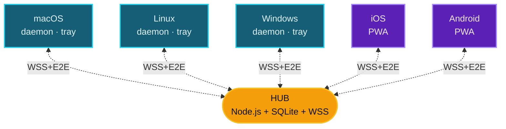

<div align="center">


# ClipSync

**局域网内多设备剪贴板同步**

在一台机器上 <kbd>Cmd</kbd>+<kbd>C</kbd> · 在另一台机器上 <kbd>Cmd</kbd>+<kbd>V</kbd> · 端到端加密 · 无云端

<br />

[](LICENSE)
[](https://nodejs.org)
[](docs/architecture/security-model.md)
[](#)

<br />

[Español](README.md) · [English](README-EN.md) · [Français](README-FR.md) · [Português](README-PT.md) · **中文** · [Italiano](README-IT.md) · [Deutsch](README-DE.md)

<br />


</div>

---

## 功能简介

当你在任意一台已注册设备上复制文本、图片或链接时,内容会自动出现在其他设备的剪贴板中。

```text
Mac:           Cmd+C  (复制一个链接)
                  ↓ ~150 ms
PC Windows:    Ctrl+V → 已就绪
iPhone:        ↑ 点击"粘贴" → 已就绪
```

无需打开任何网页,也无需手动发送任何内容。每台设备上的客户端会监听操作系统的剪贴板,并通过本地 hub 立即将变更传播到其他设备。

> [!IMPORTANT]
> Web 管理后台 `https://hub:5679/admin` 仅用于管理(注册设备、撤销访问、查看历史记录)。日常使用中**无需打开它** — 只用键盘复制和粘贴即可。

---

## 特性

| | |
|---|---|
| **跨平台** | macOS · Linux · Windows · iOS · Android(通过 PWA) |
| **仅限 LAN** | 数据从不离开你的 Wi-Fi 网络。无账户、无追踪、无云端 |
| **端到端加密** | AES-256-GCM,密钥通过 X25519 + HKDF 派生。hub 永远看不到明文内容 |
| **自动发现** | 通过 mDNS 自动找到 hub,无需手动配置 IP |
| **TOFU pinning** | 客户端在首次配对时固定 hub 的 TLS 指纹,拒绝后续变更 |
| **多种模式** | Tray app(菜单栏图标)或 daemon(无 UI 的后台服务) |
| **支持** | 文本、URL、图片和文件,最大 50 MB |

---

## 架构



| 组件 | 功能 |
|---|---|
| `hub/` | 中央服务器。WSS broker · mDNS · 管理后台 · 提供 PWA |
| `client-desktop/` | 客户端核心:同步引擎、剪贴板监听器、注册逻辑 |
| `client-tray/` | Electron 应用 — 菜单栏 / system tray 图标及菜单 |
| `client-pwa/` | 面向移动端 / 平板的 PWA(Safari iOS 17.4+、Chrome 113+) |
| `shared/` | 共享的协议常量与 crypto 辅助函数 |
| `bin/clipsync` | 统一 CLI(`status`、`switch tray\|daemon`、`register`、`logs`) |

---

## Quick start

由其中一台机器作为 **hub**(运行服务端),其余机器作为客户端连接进来。

### `1` &nbsp; 启动 hub

```bash
git clone https://github.com/DM20911/clipsync.git
cd clipsync/hub
npm install
npm start
```

首次运行时会打印一个 **admin token** — 请复制保存,只显示一次:

```text
[clipsync] Admin token (save — shown once):
[clipsync]   M24CYQAFDxJJD_GagzXtkXlY9Hnl4Zlq_Pt9gRgB-GA
```

> [!TIP]
> 同时记下 hub 的本地 IP。可通过 `ifconfig`(macOS/Linux)或 `ipconfig`(Windows)获取 — 格式为 `192.168.x.x`。

### `2` &nbsp; 打开管理后台

在网络内任意浏览器中访问:

```text
https://<ip-hub>:5679/admin
```

接受 self-signed 证书,使用 token 登录。点击 **`+ register new device`** 生成 PIN 或 QR 码。

### `3` &nbsp; 在每台设备上安装客户端

| 设备 | 命令 | 教程 |
|---|---|---|
| **macOS** | `bash scripts/install-mac.sh client` | [docs/tutorials/macos.md](docs/tutorials/macos.md) |
| **Linux** | `bash scripts/install-linux.sh client` | [docs/tutorials/linux.md](docs/tutorials/linux.md) |
| **Windows** | `.\scripts\install-win.ps1 -Role client` &nbsp;(PowerShell 管理员) | [docs/tutorials/windows.md](docs/tutorials/windows.md) |
| **移动端 / 浏览器** | 在移动端打开 &nbsp;`https://<ip-hub>:5679/` | [docs/tutorials/pwa.md](docs/tutorials/pwa.md) |

### `4` &nbsp; 开始使用

在 Mac/Linux 按 <kbd>Cmd</kbd>+<kbd>C</kbd> 或在 Windows 按 <kbd>Ctrl</kbd>+<kbd>C</kbd> → 内容约在 ~150 ms 后出现在其他设备上。

> [!NOTE]
> **[完整逐步手册](docs/tutorials/README.md)** — 介绍、原理、概念、FAQ 与故障排查。

---

## 桌面客户端模式

<table>
<tr><th width="200">模式</th><th>适用场景</th></tr>
<tr><td><strong>Tray</strong> &nbsp;<sub>推荐</sub></td>
<td>个人电脑。菜单栏图标 — 点击 → 状态、peers、最近的 clip、暂停</td></tr>
<tr><td><strong>Daemon</strong></td>
<td>无头服务器(NAS、Raspberry Pi)。无 UI 的系统服务</td></tr>
</table>

随时切换,无需重新注册:

```bash
node bin/clipsync switch tray
node bin/clipsync switch daemon
node bin/clipsync status
```

---

## 安全模型

> [!IMPORTANT]
> 所有内容均为端到端加密。hub 仅存储加密 bundle,**不持有解密任何内容所需的密钥材料**。

- **每设备独立加密**:每台设备在注册时生成一个 X25519 密钥对。发送 clip 时,发送方生成一个随机的内容密钥,使用 AES-256-GCM 加密 payload,然后通过 ECDH(X25519) → HKDF-SHA256 → AES-GCM-wrap 为每个接收方包装该密钥。
- **真正的撤销**:撤销设备会从接收方列表中删除其 pubkey。后续 clip 永远不会为其加密。
- **管理员认证**:控制台打印的随机 token(默认)、使用 scrypt 的 `CLIPSYNC_ADMIN_PASSWORD`,或"首个注册的设备 = admin"。
- **限流**:`PUSH` 与 `HISTORY_REQ` 使用 token-bucket,登录与注册按 IP 计数尝试次数。
- 桌面客户端对 hub TLS 证书的 **TOFU pinning**。
- hub 提供的 HTML 启用了 **严格 CSP**。
- 撤销设备时执行 **JTI revocation cascade**。

完整密码学模型详见 [docs/architecture/security-model.md](docs/architecture/security-model.md)。

---

## 系统要求

| | |
|---|---|
| **Node.js** | ≥ 18(推荐 20 LTS),用于 hub 与桌面客户端 |
| **macOS** | 12 Monterey 或更高版本 |
| **Linux** | 带 systemd(Ubuntu、Fedora、Arch、Debian 等) |
| **Windows** | 10 build 1903+ 或 Windows 11 |
| **Browser PWA** | Chrome 113+、Firefox 119+、Safari 17.4+ |
| **网络** | 同一私有网络(RFC1918 — `192.168/16`、`10/8`、`172.16/12`) |

---

## 技术栈

<table>
<tr><th>Hub</th><td>Node.js · <code>ws</code> · <code>better-sqlite3</code> · <code>node-forge</code>(TLS) · <code>qrcode</code> · 通过 <code>multicast-dns</code> 实现 mDNS</td></tr>
<tr><th>桌面客户端</th><td>Node.js · <code>clipboardy</code> · <code>ws</code> · 处理图片的 OS 辅助工具(osascript / wl-clipboard / xclip / PowerShell)</td></tr>
<tr><th>Tray</th><td>Electron · <code>auto-launch</code></td></tr>
<tr><th>PWA</th><td>原生 HTML/JS · Web Crypto API · IndexedDB · Tailwind CDN</td></tr>
<tr><th>Crypto</th><td><code>node:crypto</code>(原生 X25519) · HKDF-SHA256 · AES-256-GCM</td></tr>
</table>

---

## 许可证

[MIT](LICENSE)

---

<div align="center">

由 [**DM20911**](https://github.com/DM20911) 开发 — [**OptimizarIA Consulting SPA**](https://optimizaria.com)

<sub>合著者:Sombrero Blanco Ciberseguridad</sub>

</div>
