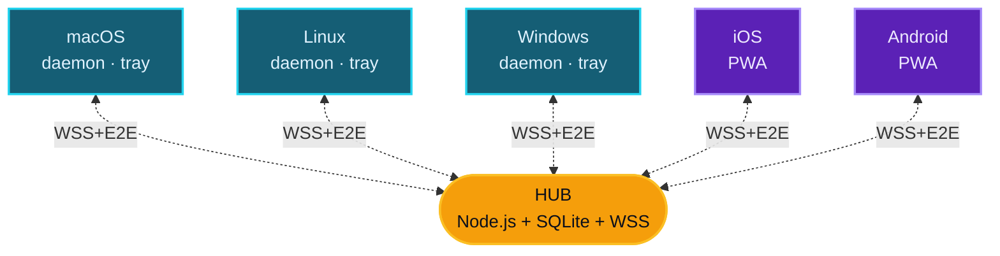

<div align="center">


# ClipSync

**Sincronización de portapapeles entre dispositivos en red local**

<kbd>Cmd</kbd>+<kbd>C</kbd> en una máquina · <kbd>Cmd</kbd>+<kbd>V</kbd> en otra · cifrado de extremo a extremo · sin nube

<br />

[](LICENSE)
[](https://nodejs.org)
[](docs/architecture/security-model.md)
[](#)

<br />

**Español** · [English](README-EN.md) · [Français](README-FR.md) · [Português](README-PT.md) · [中文](README-ZH.md) · [Italiano](README-IT.md) · [Deutsch](README-DE.md)

<br />


</div>

---

## Qué hace

Cuando copias texto, una imagen o un link en cualquier dispositivo registrado, aparece automáticamente en el portapapeles de los demás.

```text
Mac:           Cmd+C  (copias un link)
                  ↓ ~150 ms
PC Windows:    Ctrl+V → ahí está
iPhone:        ↑ tap "Pegar" → ahí está
```

No abres ninguna página, no envías nada manualmente. El cliente de cada dispositivo monitorea el portapapeles del sistema operativo y propaga los cambios al instante a través de un hub local.

> [!IMPORTANT]
> El dashboard web `https://hub:5679/admin` solo sirve para administración (registrar dispositivos, revocar acceso, ver historial). En el día a día **nunca lo abres** — solo copias y pegas con tu teclado.

---

## Características

| | |
|---|---|
| **Multi-plataforma** | macOS · Linux · Windows · iOS · Android (vía PWA) |
| **Solo LAN** | Nunca sale de tu red Wi-Fi. Sin cuentas, sin tracking, sin nube |
| **Cifrado E2E** | AES-256-GCM con claves derivadas vía X25519 + HKDF. El hub nunca ve el contenido en claro |
| **Auto-discovery** | mDNS para encontrar el hub sin configurar IPs |
| **TOFU pinning** | El cliente fija la huella TLS del hub en el primer pairing y rechaza cambios |
| **Modos** | Tray app (ícono en menu bar) o daemon (servicio sin UI) |
| **Soporta** | Texto, URLs, imágenes y archivos hasta 50 MB |

---

## Arquitectura



| Componente | Qué hace |
|---|---|
| `hub/` | Servidor central. WSS broker · mDNS · dashboard admin · sirve la PWA |
| `client-desktop/` | Núcleo del cliente: motor de sync, monitor de portapapeles, registro |
| `client-tray/` | App Electron — ícono en menu bar / system tray con menú |
| `client-pwa/` | PWA para móvil/tablet (Safari iOS 17.4+, Chrome 113+) |
| `shared/` | Constantes de protocolo + helpers de crypto compartidos |
| `bin/clipsync` | CLI unificado (`status`, `switch tray\|daemon`, `register`, `logs`) |

---

## Quick start

Una sola máquina hace de **hub** (donde corre el servidor). El resto son clientes que se conectan.

### `1` &nbsp; Levantar el hub

```bash
git clone https://github.com/DM20911/clipsync.git
cd clipsync/hub
npm install
npm start
```

A la primera ejecución imprime un **token de admin** — cópialo, se muestra una sola vez:

```text
[clipsync] Admin token (save — shown once):
[clipsync]   M24CYQAFDxJJD_GagzXtkXlY9Hnl4Zlq_Pt9gRgB-GA
```

> [!TIP]
> Anota también la IP local del hub. La obtienes con `ifconfig` (macOS/Linux) o `ipconfig` (Windows) — formato `192.168.x.x`.

### `2` &nbsp; Abrir el dashboard

Desde cualquier browser de tu red:

```text
https://<ip-hub>:5679/admin
```

Acepta el certificado self-signed. Login con el token. Click **`+ register new device`** para generar un PIN o QR.

### `3` &nbsp; Instalar el cliente en cada dispositivo

| Dispositivo | Comando | Tutorial |
|---|---|---|
| **macOS** | `bash scripts/install-mac.sh client` | [docs/tutorials/macos.md](docs/tutorials/macos.md) |
| **Linux** | `bash scripts/install-linux.sh client` | [docs/tutorials/linux.md](docs/tutorials/linux.md) |
| **Windows** | `.\scripts\install-win.ps1 -Role client` &nbsp;(PowerShell admin) | [docs/tutorials/windows.md](docs/tutorials/windows.md) |
| **Móvil / Browser** | abre &nbsp;`https://<ip-hub>:5679/`&nbsp; en tu móvil | [docs/tutorials/pwa.md](docs/tutorials/pwa.md) |

### `4` &nbsp; Usarlo

<kbd>Cmd</kbd>+<kbd>C</kbd> en Mac/Linux o <kbd>Ctrl</kbd>+<kbd>C</kbd> en Windows → aparece en los demás en ~150 ms.

> [!NOTE]
> **[Manual completo paso a paso](docs/tutorials/README.md)** — qué es, cómo funciona, conceptos, FAQ, troubleshooting.

---

## Modos del cliente desktop

<table>
<tr><th width="200">Modo</th><th>Cuándo</th></tr>
<tr><td><strong>Tray</strong> &nbsp;<sub>recomendado</sub></td>
<td>Equipo personal. Ícono en menu bar — click → estado, peers, recent clips, pause</td></tr>
<tr><td><strong>Daemon</strong></td>
<td>Servidor headless (NAS, Raspberry Pi). Servicio del sistema sin UI</td></tr>
</table>

Cambias cuando quieras sin re-registrar:

```bash
node bin/clipsync switch tray
node bin/clipsync switch daemon
node bin/clipsync status
```

---

## Modelo de seguridad

> [!IMPORTANT]
> Todo el contenido está cifrado de extremo a extremo. El hub almacena bundles cifrados pero **no posee material para descifrar nada**.

- **Cifrado per-device**: cada dispositivo genera un keypair X25519 al registrarse. Para enviar un clip, el emisor genera una clave de contenido aleatoria, cifra el payload con AES-256-GCM, y envuelve esa clave por destinatario usando ECDH(X25519) → HKDF-SHA256 → AES-GCM-wrap.
- **Revocación real**: revocar un dispositivo elimina su pubkey de la lista de destinatarios. Clips futuros nunca se cifran para él.
- **Admin auth**: token aleatorio impreso en consola (default), `CLIPSYNC_ADMIN_PASSWORD` con scrypt, o "primer dispositivo registrado = admin".
- **Rate limiting**: token-bucket en `PUSH` y `HISTORY_REQ`, attempt counter por IP en login y registro.
- **TOFU pinning** del cert TLS del hub en clientes desktop.
- **CSP estricto** en HTML servido por el hub.
- **JTI revocation cascade** al revocar un dispositivo.

Ver [docs/architecture/security-model.md](docs/architecture/security-model.md) para el modelo criptográfico completo.

---

## Requisitos

| | |
|---|---|
| **Node.js** | ≥ 18 (recomendado 20 LTS) en hub y clientes desktop |
| **macOS** | 12 Monterey o superior |
| **Linux** | con systemd (Ubuntu, Fedora, Arch, Debian, etc.) |
| **Windows** | 10 build 1903+ o Windows 11 |
| **Browser PWA** | Chrome 113+, Firefox 119+, Safari 17.4+ |
| **Red** | Misma red privada (RFC1918 — `192.168/16`, `10/8`, `172.16/12`) |

---

## Stack técnico

<table>
<tr><th>Hub</th><td>Node.js · <code>ws</code> · <code>better-sqlite3</code> · <code>node-forge</code> (TLS) · <code>qrcode</code> · mDNS via <code>multicast-dns</code></td></tr>
<tr><th>Cliente desktop</th><td>Node.js · <code>clipboardy</code> · <code>ws</code> · helpers de OS para imágenes (osascript / wl-clipboard / xclip / PowerShell)</td></tr>
<tr><th>Tray</th><td>Electron · <code>auto-launch</code></td></tr>
<tr><th>PWA</th><td>HTML/JS vanilla · Web Crypto API · IndexedDB · Tailwind CDN</td></tr>
<tr><th>Crypto</th><td><code>node:crypto</code> (X25519 nativo) · HKDF-SHA256 · AES-256-GCM</td></tr>
</table>

---

## Licencia

[MIT](LICENSE)

---

<div align="center">

Herramienta desarrollada por [**DM20911**](https://github.com/DM20911) — [**OptimizarIA Consulting SPA**](https://optimizaria.com)

<sub>Co-author: Sombrero Blanco Ciberseguridad</sub>

</div>
